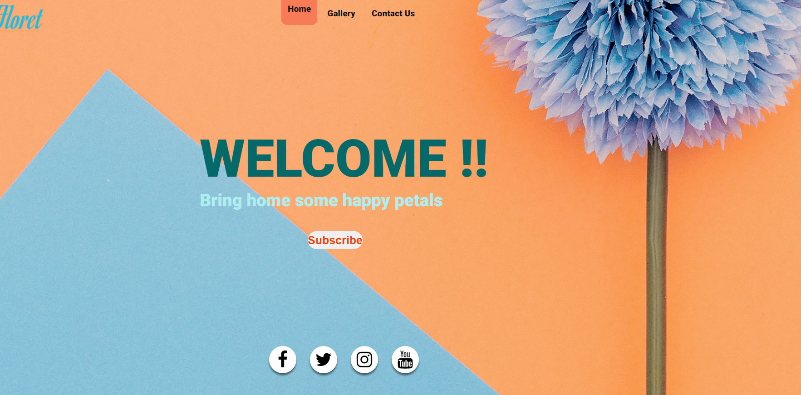
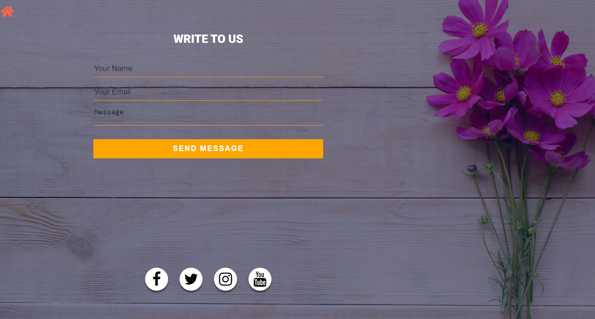

# Simple_UI

An attempt to do a simple HTML webpage with javascript actions. This definitely not a state of the art design or development.
I am aware there exists better designs and coding standards. This is an example for anyone who would like to learn HTML, CSS and vanillaJS for websevelopment. 
This is just an attempt to encourage people to take that first step towards learning new stuff. 

